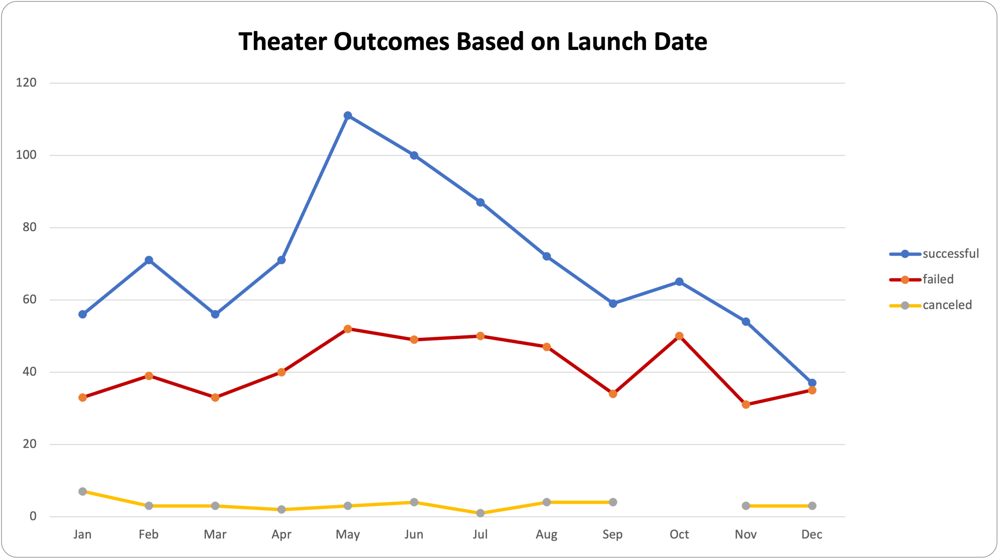
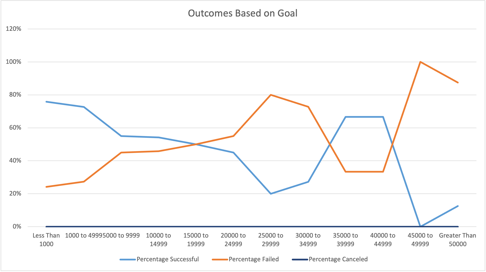

# Kickstarting with Excel

## **Overview of Project**

The porpuse of this new project is compare different campaigns fared in relation to their launch dates and their funding goals analysing all the data inPivot tables and charts 

### Purpose

Help our client determine if the goal and the time of the fundraising was right

## Analysis and Challenges

### Analysis of Outcomes Based on Launch Date

We need to analyse the category  of theater, so a filter must done . We can detected an increase of historical successelful outcomes in May and June

### Analysis of Outcomes Based on Goals

A filter in the data in subcategory of play help us to find that more than 70% of the goals are less than 4999 with a very good success rate between 73 and 76% with  no case of canceled

### Challenges and Difficulties Encountered

No enough goals if 20,000 or more. No cancelation in 1047 projects can be a error 

## Results

- What are two conclusions you can draw about the Outcomes based on Launch Date?
	1. Project with goals over 15000 are too risk
	2. Project with goals under 5000 has better succesfuls percentages

- What can you conclude about the Outcomes based on Goals?
	- We have no enough information to determinate a conclusion

- What are some limitations of this dataset?
	- Because Louise is almost done in her fundrasing, this can be considered an outdated data base

- What are some other possible tables and/or graphs that we could create?
	- Compare Years and countries
